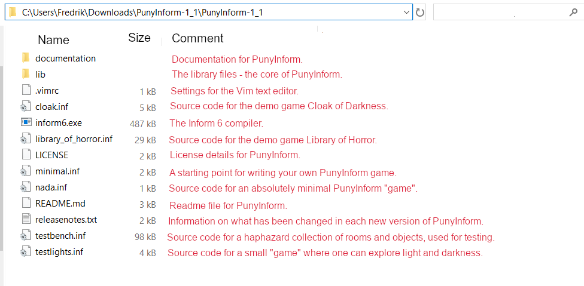
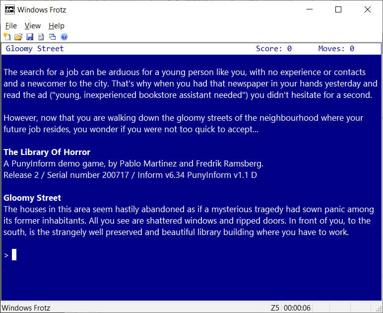
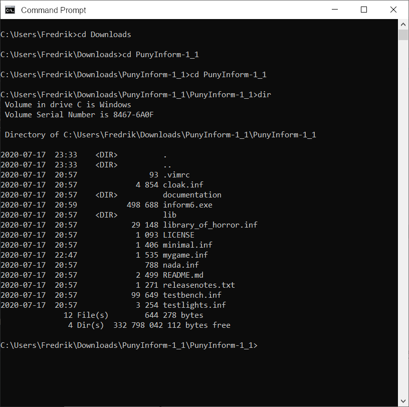
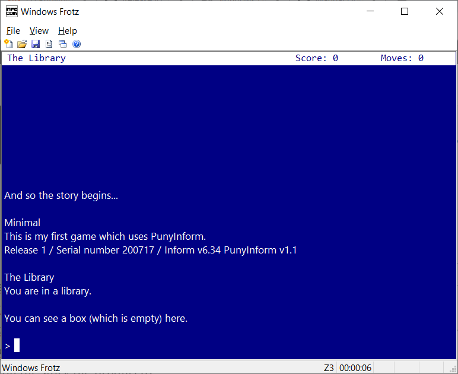
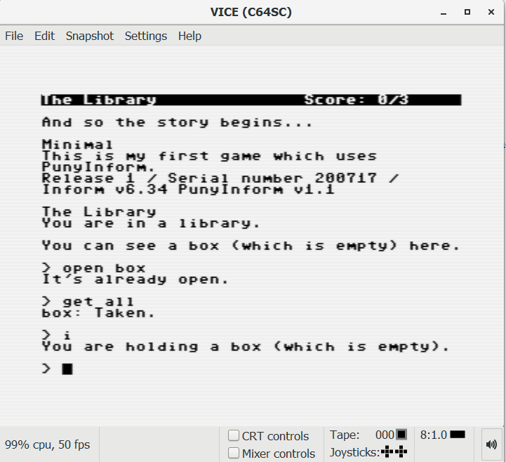

Let's have a look at what you need to download and install to start
writing a game using PunyInform. For this article, I will be using
Windows, but you can also use PunyInform on Mac or Linux.

# Step 1: Install the PunyInform library
Go to https://github.com/johanberntsson/PunyInform/releases and download
the newest version of PunyInform (the version that comes first on the
page) by clicking on "Source code (zip)" under Assets. When it has
finished downloading, click on the Zip archive in your browser window to
open the archive in Windows Explorer, click on "Extract All" near the
top of the window, just below the menu bar. Pick a folder where you want
to place the PunyInform files. Windows Explorer will probably suggest
something like `"C:\Users\MyUsername\Downloads\PunyInform-1_2\"` and
that should work fine. You can always rename and/or move the folder
later.

# Step 2: Get the compiler
PunyInform is a library for the Inform 6 programming language. To use
it, you will need to download the compiler, called "inform" or
"inform6". PunyInform requires at least version 6.35 of the compiler. If
you use Windows, it's available as a binary executable, so you can just
download it and start to use it. Go to
https://www.ifarchive.org/indexes/if-archive/infocom/compilers/inform6/executables/
and download inform635_win32.zip.

Open the Zip archive and extract the file (there is just one) in the
base folder of PunyInform (the folder which has the subfolders
"documentation" and "lib" in it).  This is what your PunyInform folder
may look like now:

{ width=450px }

# Step 3: Install a Z-code interpreter
While the real selling point for PunyInform is that it allows you to
write games that are fast enough and small enough to be played on
8-bits, the games produced will be equally playable on pretty much any
computer, and you will soon find that you can do most of the testing on
your modern PC.  To do this you will need a Z-code interpreter.

PunyInform compiles Inform 6 source code to Z-code, a game format
invented by the text adventure wizards at Infocom. A Z-code file is in
fact a memory image for a virtual/imaginary computer called the
Z-machine. While the Z-machine doesn't physically exist, it can be
emulated on a wide array of platforms, including the 8-bit computers of
the eighties, but also 16-bit computers like Commodore Amiga and Atari
ST, as well as computers running MS-DOS, any flavour of Windows, Mac OS,
Unix, Linux, Android -- you name it. It just takes a Z-code interpreter
(an emulator for the Z-machine) for that platform. There is a very
popular interpreter called Frotz, which has been ported to many
different platforms. For Windows, I recommend you get Windows Frotz.

{ width=450px }

Go to http://www.davidkinder.co.uk/frotz.html , download Windows Frotz
and run the installer.  Then start Windows Frotz once, to make sure it
has set file type associations properly.

# Step 4: Start writing your first game

In Windows Explorer, make a copy of the file minimal.inf and call it
mygame.inf .  Then open mygame.inf in Notepad (or some text editor you
prefer -- if you want something really nice, you can get the Atom text
editor and install the package "language-inform6" under
File -> Settings).

The file mygame.inf should now look something like this:

```
!% -~S
!% $OMIT_UNUSED_ROUTINES=1
! The very first lines of the main source code file for a game can
! contain compiler options, like the two lines above.
! -~S disables strict error checking. This is otherwise used in z5
!     and z8 games by default. While useful for debugging, it adds
!     ~10 KB to the story file size and it makes the game slower.
! $OMIT_UNUSED_ROUTINES=1 makes the compiler remove all routines
!     which aren't used. This can save some space.

Constant Story      "Minimal";
Constant Headline   "^A sample game which uses PunyInform.^";

! Uncomment ONE of the two following lines, to show either time or
! score/turns. Leaving both commented out makes the library bigger.
!Constant STATUSLINE_TIME; Statusline time;
Constant STATUSLINE_SCORE; Statusline score;

! Uncomment to add optional features to PunyLib
!Constant DEBUG;
!Constant CUSTOM_ABBREVIATIONS;
Constant OPTIONAL_NO_DARKNESS;
!Constant OPTIONAL_ALLOW_WRITTEN_NUMBERS;
!Constant OPTIONAL_EXTENDED_METAVERBS;
!Constant OPTIONAL_EXTENDED_VERBSET;
!Constant OPTIONAL_PRINT_SCENERY_CONTENTS;
!Constant OPTIONAL_FULL_SCORE;
!Constant OPTIONAL_FULL_DIRECTIONS;
!Constant OPTIONAL_SIMPLE_DOORS;
!Constant OPTIONAL_SHIP_DIRECTIONS;
!Constant OPTIONAL_GUESS_MISSING_NOUN;
!Constant OPTIONAL_MANUAL_SCOPE;
!Constant OPTIONAL_ORDERED_TIMERS;
!Constant RUNTIME_ERRORS = 0;

! Define any library constants you need here, like MAX_SCORE, 
! AMUSING_PROVIDED, MAX_CARRIED, SACK_OBJECT,  etc.

Constant INITIAL_LOCATION_VALUE = Library;

Include "globals.h";

! Define your own global variables here, if any

! Define the entry point routines you need here, like
! Amusing, DarkToDark etc.

! Uncomment to add PunyLib extensions
!Include "ext_menu.h";
!Include "ext_flags.h";
!Include "ext_quote_box.h";
!Include "ext_cheap_scenery.h";

Include "puny.h";

! Uncomment to add PunyLib extensions
!Include "ext_waittime.h";

Object Library "The Library"
	with
		description "You are in a library.";

Object -> Box "box"
	with
		name 'box',
		inside_description "It feels so nice, standing in the box.",
	has container open openable enterable;

[Initialise;
	print "^^And so the story begins...^^";
];
```
Now change the text in the line which starts with Constant Headline
(Line 9 from the top). Change A sample game to This is my first game or
something else you find amusing. Save the file.

# Step 5: Compile the game
Start a command prompt (In Windows 10, click the Windows Start icon on
the Windows menu bar and type cmd , then click on Command Prompt.)

Now use the command CD to go to the base folder of PunyInform. If it's
on a different device, you can type the device letter and ":" to switch
to that device first, like `D:` and then `CD` to go to the right folder.
`CD ..` goes up one level and `CD \` (that's a backslash character) goes
to the root folder on the current device. If you start writing a folder
name, you can press the `TAB` key multiple times to see all files and
folders with a matching name. Use `DIR` to list the files in the current
folder.

{ width=450px }

Now, to compile your source code, type:

`inform6 -v3 +lib mygame`

This tells the Inform 6 compiler to read the source code in mygame.inf
and compile it into a Z-code version 3 file (a so-called "story file")
called `mygame.z3`, and to look for library files in the folder lib.
There are many more commandline switches available for the Inform 6
compiler. To list them all, type `inform6 -h2`. Most of the time, when
using PunyInform, I find myself using the commandline switches `-e` (to
use string abbreviations, making the story file smaller) and `-s` (to
print some statistics on the story file produced).

# Step 6: Start your game in Windows Frotz
Now use Windows Explorer to go to the PunyInform base folder. You should
see mygame.z3 there.  Double-click it. The game should now launch in
Windows Frotz.

{ width=450px }

# Step 7: Turn your game into a C64 disk image
Now let's make a Commodore 64 version of your game. To do this, we will
bundle the story file with a Z-code interpreter called Ozmoo. Go to
http://microheaven.com/ozmooonline/ . Under "Upload Z-code file", pick
the file mygame.z3 and click "Upload".  Then, under Build game, make
sure the story file mygame.z3 is selected, then scroll to the bottom of
the page and click "Build". If all goes well, you get a message that the
game was successfully built, and under Files you can see mygame.d64.
Click on the filename to download the file.

# Step 8: Test your game on an (emulated) C64

If you don't have a Commodore 64 emulator installed already, this should
get you going.

Download WinVICE from
https://vice-emu.sourceforge.io/index.html#download and unzip it in a
folder of your choice. You may need to install 7-Zip to unzip WinVICE.
Then go to this folder in Windows Explorer and double-click x64sc.exe .
Click File -> Attach disk image -> Drive #8 and point to mygame.d64.
Then type `load"*",8` and press enter.  If you get tired of the
(realistic) loading time, you can press Alt-W to toggle warp mode
(maximum speed). When the game has finished loading, make sure warp mode
is turned off, type run and press enter. The game now decompresses and
then it starts.

{ width=450px }
